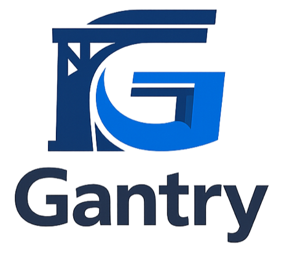
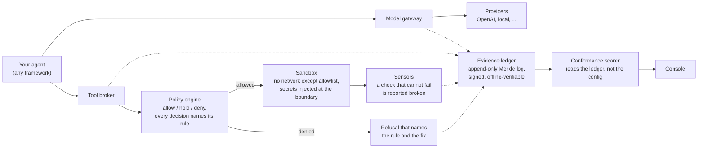

<p align="center">
  
</p>

# Gantry

**A control plane that sits between your AI agents and everything they can
touch, records every decision on a tamper-evident log, and scores how well it
is doing that from its own telemetry rather than its own documentation.**

One static binary. No cloud account, no phone-home, runs air-gapped. Works
with any model provider and under any agent framework.

## The problem, in plain English

An agent is two things: a model, and the harness around it. The model writes
the code. The harness decides whether the command it just proposed is allowed
to run, what credentials it can see, what happens when a check fails, and
whether anyone can reconstruct all of that afterwards.

The industry spent five years on the model half. The harness half is still
hand-assembled at every company that needs one: a permissions file here, some
logging there, an approval step that exists in a Slack thread. It works until
someone asks a question it cannot answer.

Three questions in particular:

1. **What did the agent actually do last Tuesday?** Not the chat transcript.
   Which tools it called, with what arguments, under what policy version,
   approved by whom.
2. **What stopped it from doing worse?** If the answer is "the prompt told it
   not to," you have a suggestion, not a control.
3. **Can someone who was not in the room verify any of that?** Logs you can
   edit prove nothing about a system you operate.

Gantry is the harness half, built as a product instead of assembled per
project. Every model call goes through one gateway. Every tool call goes
through one broker that consults a policy and names the rule behind each
decision. Both write to an append-only cryptographic log that a third party
can verify offline, without trusting the binary that wrote it.



Solid arrows are the request path. Dotted arrows are the record: nothing is
trusted that is not on it, and the score at the end is derived from that
record rather than from what any config file claims.

## Why you would want it

- **You are shipping agents that touch production.** You need a place where
  authority is declared once, enforced in code, and recorded, instead of
  spread across prompts and config files.
- **Someone is going to audit this.** A security review, a client, a
  regulator. Gantry produces evidence as a side effect of running, so the
  answer is a log export, not a reconstruction project.
- **You cannot send data out.** No hosted control plane, no licence check, no
  CDN font. The test suite runs with an empty network namespace, which is what
  keeps that claim honest.
- **You do not want to marry a framework.** Gantry sits underneath LangGraph,
  Temporal, Claude Code, or a shell script. Point your existing harness at the
  gateway and broker and you inherit the tool, sandbox, observability and
  governance layers without rewriting your agent.
- **You want a number you can defend.** The scorer reads what actually ran. A
  layer with no telemetry scores N/A, not a generous guess.

**What it is not:** not an agent framework, not a chat product, not an eval
platform, not a skills marketplace, not a compliance certification. It
produces evidence. Interpreting that evidence against a regime is a separate
job.

## The twelve primitives, in plain English

Gantry is organised around a rubric that decomposes any agent harness into
twelve layers. The rubric is the measuring instrument; Gantry is that
instrument pointed at itself and satisfied by construction.

Each layer scores 0 to 5. The overall level is the **minimum**, never the
average, because one missing layer is what an attacker or an auditor finds.
Nine strong layers and no record of what happened is a weak system.

| # | Layer | What it means | What goes wrong without it |
|---|---|---|---|
| 01 | Instruction | Who the agent is and the rules it works under, kept in version control like code | Prompts edited live in a dashboard. Nobody can say what the agent was told last week |
| 02 | Context delivery | Actually handing the model the file, the failing test, the stack trace | The agent is asked about a system it was never shown, and the hallucination gets blamed on the model |
| 03 | Context management | Choosing what enters the window right now, against a budget, with stale material expired | Whole wikis stuffed into every prompt. Wrong context is worse than none: it is a plausible distraction that fails confidently |
| 04 | Tool interface | Structured calls with names, schemas and validated inputs, and tool output treated as untrusted | A tool called "run any shell command," and its output piped straight into the next decision |
| 05 | Execution environment | Where commands run and with what access: sandbox, filesystem scope, network rules, credentials | The agent runs with a developer's full credentials on their laptop. This is a security finding, not a maturity gap |
| 06 | Durable state | The workbench that survives a crash: plans, checkpoints, task state, a graph of the codebase | Everything lives in the conversation. Every session restarts from zero |
| 07 | Orchestration | How work moves: retries, gates, approvals, escalation, step ordering | One loop that either succeeds or dies. A human finds out from the output, or never |
| 08 | Sub-agents | Splitting work into specialists with narrow scope, narrow context and narrow tools | Either one agent does everything, or a swarm exists for show with no consistency |
| 09 | Skills | Reusable procedures loaded at the right moment, with steps and tools named | The process lives in one person's head or one old thread |
| 10 | Verification | The agent says done, the harness says show me: tests, builds, type checks, evals | The final sentence is trusted because it sounds confident. The most common and most silent failure in the field |
| 11 | Observability | The recorder: tool timelines, cost, prompt versions, approvals, replayable | Service-uptime monitoring mistaken for agent observability. Nobody can reconstruct the run |
| 12 | Governance | Who the agent acts as, what it may do, under which policy, and the record that proves it | The authority is real but undeclared, inherited from whoever set up the machine, and nothing reports when the running system drifts from the stated policy |

Layers 10, 11 and 12 are the trust layers. They are the ones nobody builds,
and because the score is a minimum, they are usually the ones setting it.

Full definitions with scoring anchors: `docs/PRIMITIVES.md`.

## Quick start

Rust toolchain, then build and make a ledger. These run from the repository
root; the next section shows the same thing in a directory of your own.

```
cargo build
./target/debug/gantry ledger init /tmp/demo/ledger
```

Ask the broker to run something destructive. It refuses and tells you which
rule refused, plus what to do instead:

```
$ ./target/debug/gantry broker call /tmp/demo/ledger Bash "rm -rf /"
policy denied Bash on rm -rf /: rule r-destructive-shell fired and the
decision is on the ledger. Fix: This command is destructive and its
capability's rollback handle cannot recall it. Scope the deletion to a path
the run owns, or route it through a capability whose rollback genuinely
covers it.
refusal recorded (ledger sealed at size 7)
```

Now do something allowed. It runs inside a sandbox, and the result is marked
as untrusted data:

```
./target/debug/gantry broker call /tmp/demo/ledger Read docs/PLAN.md
```

Verify the log. This checks the Merkle chain and every signature, and it needs
no network and no server:

```
$ ./target/debug/gantry ledger verify /tmp/demo/ledger
entries: 14
```

Score what just happened:

```
$ ./target/debug/gantry score /tmp/demo/ledger
| Primitive | Score | Evidence |
|---|---|---|
| 01 Instruction | 3 | instruction pack version-pinned on every run.open; no lifecycle telemetry, so capped at 3 |
| 02 Context delivery | N/A | N/A: no telemetry for this primitive in this ledger |
| 03 Context management | N/A | N/A: no telemetry for this primitive in this ledger |
| 04 Tool interface | 4 | tool results carry taint |
| 05 Execution environment | 4 | commands run inside a seatbelt sandbox, recorded per request |
| 06 Durable state | N/A | N/A: no telemetry for this primitive in this ledger |
| 07 Orchestration | N/A | N/A: no telemetry for this primitive in this ledger |
| 08 Sub-agents | N/A | N/A: no telemetry for this primitive in this ledger |
| 09 Skills | N/A | N/A: no telemetry for this primitive in this ledger |
| 10 Verification | N/A | N/A: no telemetry for this primitive in this ledger |
| 11 Observability | 3 | requests, decisions and results all flow through the chokepoint onto the signed ledger |
| 12 Governance | 3 | authority-as-code produced a named denial; permission-mode divergence is recorded per event when the host exposes the mode, unobserved otherwise |

**Overall level: 3** (the minimum across 5 scored primitives, not the average).
```

The N/A rows are the point. Those layers were not exercised in this ledger, so
they are reported as unmeasured rather than assumed fine. Scoring is itself a
ledger event, so the entry count grows each time you run it.

To exercise every layer at once and reproduce the full scorecard below:

```
zsh docs/proof/08-run.sh
```

### Starting a harness of your own

The binary reads `config/policy.json`, `config/providers.json`,
`config/scoring.json`, `config/sensors/` and `instructions/pack.md` relative
to the working directory. `template init` writes that whole layout, so a new
directory runs standalone:

```
$ ./target/debug/gantry template init templates/laptop ~/my-harness
template templates/laptop validates: profile laptop, 5 capabilities, 8 rules,
3 provider(s), 12 scoring rule(s), 1 sensor(s), 1 signing key(s)
wrote /Users/you/my-harness/config/policy.json
wrote /Users/you/my-harness/config/providers.json
wrote /Users/you/my-harness/config/scoring.json
wrote /Users/you/my-harness/instructions/pack.md
wrote /Users/you/my-harness/config/sensors/no-private-key.json
wrote /Users/you/my-harness/config/skill-keys.json
harness initialised at /Users/you/my-harness from template templates/laptop
```

Then `cd ~/my-harness` and the commands above work there. Edit
`config/policy.json` to declare your capabilities and rules, and replace
`instructions/pack.md` with your own; its hash is pinned onto every event, so
changing it is a recorded change rather than a quiet one.

The bundle validates as a whole before a single file is copied. Every part
loads through the same validator the running system uses, which is what stops
a template from producing a directory the platform would refuse at runtime.
`gantry template validate <dir>` runs that check on its own, and CI runs it on
every push.

## The console

Gantry has one web UI, and it is deliberately small. The binary serves it
itself, so there is no second process in the container and no build step.

```
$ ./target/debug/gantry console /tmp/demo/ledger 127.0.0.1:8731
console at http://127.0.0.1:8731/ (ctrl-c to stop)
```

Open that address and you get the conformance scorecard: the overall level,
one row per primitive with its score colour-coded, and the evidence sentence
behind each number. The ledger is re-scored on every request, so the page is
the current state rather than a snapshot. It binds loopback by default; an
operator who exposes it further does so on purpose.

`gantry score <ledger> <rules.json> <out.html>` writes the same page to a file
if you want to attach it to a report.

What the console is not, yet: there is no ledger browser, no run timeline, no
approval inbox, no live event stream. Those are operator and auditor surfaces
that the ledger supports but the UI does not draw. The console is for reading
the score. Everything else is CLI.

## What runs today

- **Evidence ledger** (`src/ledger.rs`): append-only Merkle log, RFC 6962
  construction, signed tree heads, offline inclusion and consistency proofs.
  Nothing is trusted that is not on this record. Actor attestations verify
  against a registered key or are counted as unverified, never assumed.
- **Model gateway** (`src/gateway.rs`): the one chokepoint every model call
  passes, normalising across providers and pinning the instruction and policy
  version per call. A code path that reaches a provider SDK directly fails the
  build.
- **Tool broker and policy engine** (`src/broker.rs`, `src/policy.rs`): one
  policy decision per tool call, an MCP-shaped registry that refuses loose
  tool definitions, and denials that name their rule. A deny rule shadowed by
  an earlier allow refuses to load rather than sitting there unreachable.
- **Sandbox and credential broker** (`src/sandbox.rs`, `src/secrets.rs`):
  per-run seatbelt isolation, network denied except an allowlist, and secrets
  the model never sees. Agents hold handles; the broker substitutes the real
  value into the child process environment at the boundary, never into a
  prompt, a command string or an event.
- **Sensor bus** (`src/sensor.rs`): checks with lifecycle placement whose
  verdicts name the fix. Every sensor declares a negative control it must
  reject, so a sensor that has quietly stopped working is reported broken
  rather than clean. A green board of dead sensors is the failure mode this
  prevents.
- **Orchestrator and trust budget** (`src/trust.rs`): every capability holds a
  rung that decides where the human stands. Rungs are earned by clean sensor
  history under a named approver and lost automatically on the next failure,
  and the current rung is replayed from the ledger rather than stored.
- **Durable state and corpus graph** (`src/durable.rs`, `src/graph.rs`): a
  killed run resumes from its last checkpoint; the graph answers questions
  about the codebase by reading a fraction of a flat scan, and reports the
  cases where it loses.
- **Skills and delegation** (`src/skills.rs`): signed skill packages resolved
  against a managed key registry or refused. A package with broken metadata, a
  missing step or an unverifiable signature is refused at resolve time, never
  published on its title. Delegation can only narrow scope.
- **Conformance scorer** (`src/scorer.rs`): the rubric as a running service.
  Every predicate is a statement about ledger events, so it cannot be talked
  into a better number.

`gantry` with no arguments lists every subcommand.

## Gantry scored by Gantry

The table below is produced by `gantry score` reading a ledger that exercised
the layers, not by reading this file. The scoring rules are data
(`config/scoring.json`), so anyone holding an exported ledger re-derives the
same twelve numbers without trusting the binary.

| # | Primitive | Score | Why |
|---|---|---|---|
| 01 | Instruction | 3 | Instruction pack version-pinned per run; no lifecycle telemetry, so capped at 3. |
| 02 | Context delivery | 3 | Normalised model.call events with a pinned prompt hash. |
| 03 | Context management | 3 | Window budget and actual recorded per call; graph retrieval ledgered with its byte cost and staleness re-reads. |
| 04 | Tool interface | 4 | MCP-shaped registry, taint on every result. |
| 05 | Execution environment | 4 | Commands run inside a seatbelt sandbox, recorded per request. |
| 06 | Durable state | 3 | A run resumed from a checkpoint: the seam is on the record. |
| 07 | Orchestration | 3 | A rung earned promotion under a named approver. |
| 08 | Sub-agents | 3 | A delegated run records subagent.spawn, and the chokepoint denies an out-of-grant call with rule r-delegation. |
| 09 | Skills | 3 | Signed packages resolved against the managed key registry or refused; resolved steps execute through the broker under the delegated grant. |
| 10 | Verification | 4 | A sensor that could not fail was reported broken, not clean. |
| 11 | Observability | 3 | Requests, decisions and results all flow through the chokepoint onto the signed ledger. |
| 12 | Governance | 3 | Authority-as-code produced a named denial; the running permission mode is recorded per event and divergence from the tracked declaration is reported. |

**Overall level: 3.** Four layers stand at 4. The floor moved from 2 to 3 when
graph retrieval started emitting telemetry, not when this file was edited.
That is the whole design: the number follows the record.

Reproduce:

```
cargo build
zsh docs/proof/08-run.sh
```

## How strictness is selected

One profile sets isolation, gate placement, anchoring and identity together.
`laptop` is the default and ships in `templates/laptop`.

| Profile | Isolation | Identity | Ledger | Default rung |
|---|---|---|---|---|
| `laptop` | OCI plus seccomp, empty egress allowlist | local accounts | local file | autonomous, post-hoc review |
| `team` | kernel-level sandbox | OIDC | anchored daily to object storage | assisted |
| `regulated` | microVM | OIDC required, no local fallback | HSM or TPM keys, external timestamping | assisted, no promotion without a named approver |

The rule that keeps this honest: the scorer reads what is running, never the
profile name. `laptop` scores 3 on execution environment and says so.
`regulated` refuses to start when a requirement is unavailable rather than
degrading quietly.

## Building

Rust, one static binary, no runtime to install on the target.

```
cargo build
cargo test
zsh ci/run.sh    # format, clippy as errors, offline suite, policy parity, sensor liveness
```

The suite runs offline. `tests/invariants.rs` fails the build if the HTTP
client is referenced outside the gateway, which is how the one-chokepoint rule
stays true instead of being a paragraph in a guide.

On a machine where a tool named `cc` shadows the C compiler on `PATH`,
`.cargo/config.toml` pins the linker and `CC` to `/usr/bin/cc` so the build
does not depend on `PATH` order.

## Where to read next

| File | What it answers |
|---|---|
| `docs/PRIMITIVES.md` | The full rubric with scoring anchors for all twelve layers |
| `docs/CONCEPT.md` | The thesis and the architecture decisions, including why not blockchain |
| `docs/PLAN.md` | The slice order and why each slice makes the next one safer |
| `docs/POLICY-SCHEMA.md` | How to write policy: rules, capabilities, gates, rollback handles |
| `docs/EVENT-SCHEMA.md` | Every event type on the ledger and its fields |
| `docs/proof/` | One adversarial proof per slice. Each was produced by running the thing, not by reasoning about it |
| `docs/DEPENDENCIES.md` | Every dependency and why it is here. CI fails on an undocumented one |
| `CLAUDE.md` | The invariants an agent working on this repo must hold, each naming what enforces it |

## Attribution

Two sources are load-bearing. The twelve-primitive decomposition of an agent
harness, and Birgitta Böckeler's guide and sensor taxonomy (martinfowler.com,
April 2026), which is where the distinction between a rule that advises and a
check that fires comes from.

## Licence

Apache License 2.0, full text in `LICENSE`. Apache rather than MIT because
this is a security control plane meant to be embedded in other people's
stacks, and Apache carries an explicit patent grant that enterprise legal
review looks for. Copyright Mariano215.

## Status

Pre-1.0. Nine slices are built and proven; the API is not yet stable. The name
collides with a long-running Joomla template framework, so the published
package name may differ.
