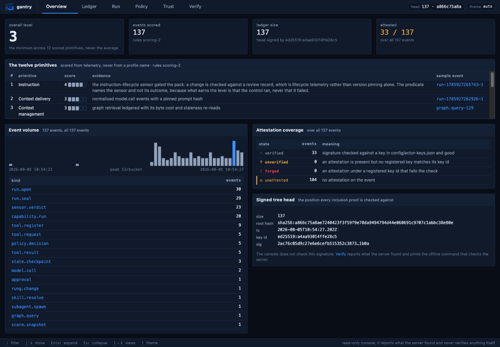
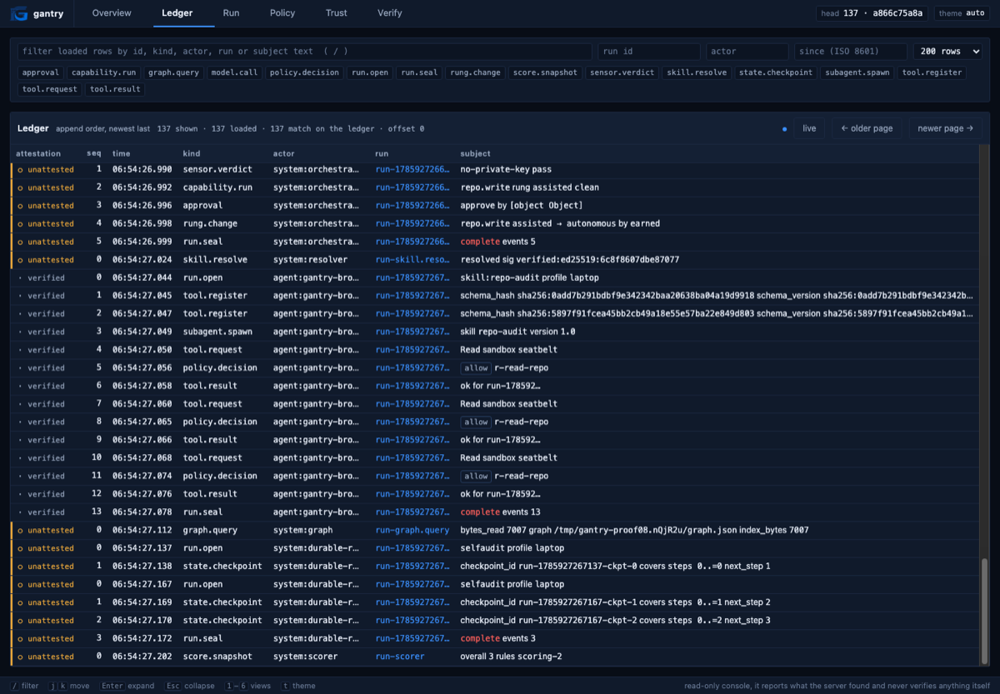
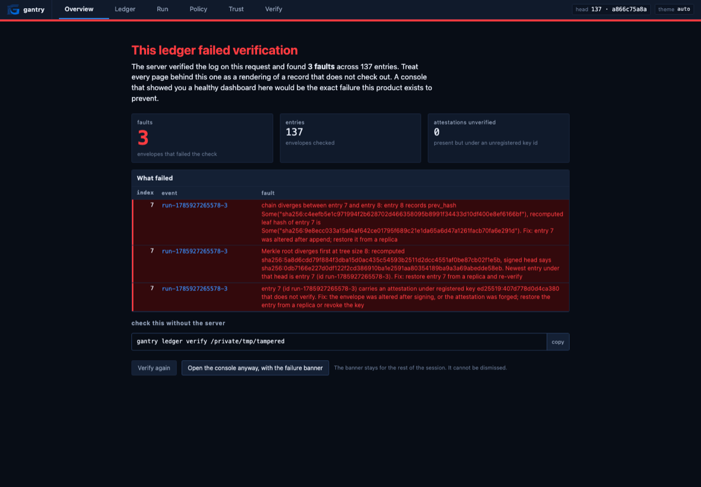

# Proof 11, the operator console

## 1. The claim

The binary serves an operator console from the same process. Six views over
the read-only API from slice 10, built as hand-written HTML, CSS and ES
modules embedded with `include_str!`. No framework, no build step, no package
manager, no external fetch of any kind.

The stack is not a preference. `CLAUDE.md` requires the UI to be static assets
the binary serves with no second process; the air-gap claim forbids a CDN font
or a remote script; and `docs/DEPENDENCIES.md` is a census a `node_modules`
tree would make meaningless. A framework would have shipped faster and cost
the strongest claim the project makes.

The claim that matters most is negative: **the console cannot render a broken
ledger as a healthy one.**

## 2. The attack

1. Serve a real ledger. Every number on screen must trace to an event on it.
2. Confirm no asset reaches any host. A single external font would end the
   air-gap claim.
3. Serve a ledger with one altered event. The console must refuse to present
   it as healthy, and the refusal must be the interface, not a badge.
4. Confirm the console never claims to have verified anything itself.

## 3. What happened

Driven in a headless browser against a 137-event ledger built by
`docs/proof/08-run.sh`, not reasoned about.

Every asset served by the binary, with the content types the browser needs:

```
/                    text/html; charset=utf-8                 2488 bytes
/console.css         text/css; charset=utf-8                 25924 bytes
/app.js              text/javascript; charset=utf-8           9934 bytes
/api.js              text/javascript; charset=utf-8           3271 bytes
/ui.js               text/javascript; charset=utf-8          13363 bytes
/views.js            text/javascript; charset=utf-8          33376 bytes
/some/hash/route     text/html; charset=utf-8                 2488 bytes
```

The last line is the routing rule: any non-API path that is not an asset
serves the shell, so the front end owns its own routes.

External references in `assets/`, excluding the SVG namespace and the one
inline data URI: none. The only `fetch` in the code is same-origin.

**Overview.** Overall level 3, primitive 1 at 4, 137 events, head signed,
33 of 137 events attested. The attestation coverage panel breaks the four
states out separately, and 104 unattested events are counted in amber rather
than omitted.



**Ledger.** Unattested rows carry a distinct mark and colour from verified
ones. Filters by kind, run, actor and time.



**Trust.** `repo.write` shows declared `assisted` against earned
`autonomous`, with the earned rung marked "gated on", because that is the one
the broker consults.

**The takeover.** One event's `ts` altered by hand on a copy of the ledger,
then served. Requesting the overview renders this instead:



Three faults named, the offline command printed verbatim, and the note that
the banner cannot be dismissed for the rest of the session. The failure page
is reached from any view, not only the overview, and a `/api/verify` that
cannot be read at all takes over the same way, because a ledger nobody could
check is not a ledger that passed.

The footer of every view reads: "read-only console, it reports what the
server found and never verifies anything itself."

## 4. What surprised you

**Looking at it found two bugs that reading it would not have.**

The first was cosmetic and instructive. An `approval` subject carries its
approver as `{"id": "user:mariano@local", "source": "local"}`, and the subject
summary called `String()` on it, so the ledger view read `approve by [object
Object]`. That is worse than blank, because it occupies the space where data
should be and looks like a value. Fixed at the shared formatter rather than
the one call site: any object value now renders its `id` or nothing at all.

The second was not cosmetic. `scorecard_html` interpolated the scoring rules'
`name` and `evidence` into HTML without escaping. Those come from
`config/scoring.json`, and the entire argument for shipping the rules as data
is that a third party runs their own against an exported ledger. The output
file is the thing somebody attaches to a report. The escape function already
existed in the module and was dead; the fix was to call it.

**A field the API returned and the console never read, found by the render
check rather than by review.** `/api/events` has carried `_attestation_trust`
on every row since proof 10, and `docs/CONSOLE-API.md` says what it is for:
"The console must qualify a verified badge with this. A laptop run and an
HSM-backed deployment must not render identically, because the difference is
the entire claim." Nothing in `assets/` read it. Every signature on this
ledger is produced under the tracked laptop key, whose seed is published, and
the console rendered it as a plain `verified`.

This is proof 10's finding a second time, one layer out. There the producer
and the verifier were each correct and the sentence they made together was
wrong; here the API was correct, the contract was correct, and the front end
simply never wired the field up, so the whole apparatus of counting fixture
attestations apart ended at the last hop. A prose rule in a contract document
is not a check, which is this project's own thesis applied to its own
contract.

`attMark` in `assets/ui.js` now renders `verified (fixture)` with its own
glyph and colour, shape first so the distinction survives monochrome, and
`ci/console-render.sh` asserts that string reaches the ledger view. Renaming
`_attestation_trust` in `src/console.rs` fails the gate, which is how this
was confirmed rather than assumed.

**The verification takeover was harder to get right than the six views.** The
easy implementation shows a banner. The banner is the wrong shape: it lets the
reader keep looking at numbers rendered from a record that does not check out,
which is the failure mode the whole product is aimed at. Making the failure
the interface, and making the dismissal leave a permanent non-dismissible
band, is a design decision that had to be specified in
`docs/CONSOLE-API.md` before it was built, because a front end left to its own
judgement will always choose the banner.

## 5. Conformance delta

No primitive moved. The console reads the ledger and writes nothing to it, so
there is no new telemetry for the scorer to credit, and inventing a rule that
scored a project for having a UI would be exactly the kind of self-flattery
the scorer exists to prevent.

What changed is legibility. Primitive 11's evidence has been true since slice
01 and unreadable without the CLI until now.

## 6. What is still a guide

- **A shape change is now a gate failure, but only for what renders without a
  click.** `ci/console-render.sh`, run by `ci/run.sh` on every push, builds an
  eleven-event ledger with two commands, serves it with the real binary,
  renders all six views in headless Chrome with `--dump-dom`, and asserts that
  values read out of that ledger at check time appear in the dumped DOM: the
  root hash, the signing key id, the head size, the run id, the rule the
  denial resolved to, the count of rules that never fired, the declared
  against earned rung comparison, and the reproduce command. It also refuses a
  DOM containing `[object Object]`, `undefined` or `NaN`, because a reshape
  usually renders the hole rather than nothing. The check was proved able to
  fail by renaming `fired`, `earned_rung` and `_attestation_state` in
  `src/console.rs` one at a time and watching a different view go red each
  time; with no browser on the machine it exits non-zero rather than skipping.
  What it does not reach is anything behind an interaction: the expanded row
  detail, and with it `/api/events/:id`, is still covered only by
  `tests/console.rs` at the API boundary, and layout is not checked at all.
- **Live update is a five second poll, not a stream.** An expanded row
  collapses when a poll repaints.
- The Run view loads at most 1000 events and does not yet warn when a run is
  truncated at that limit.
- Light-mode contrast was judged by eye, not measured against WCAG. Tables are
  plain tables, not ARIA grids, and columns are not sortable.
- `dev/` ships a fixture server used to reach states a real ledger cannot
  easily produce. Nothing in `src/` may reference it and no `include_str!`
  points at it, but nothing enforces that either.
